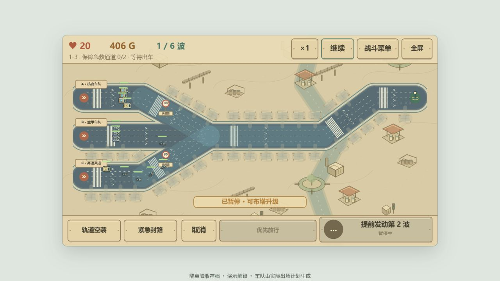
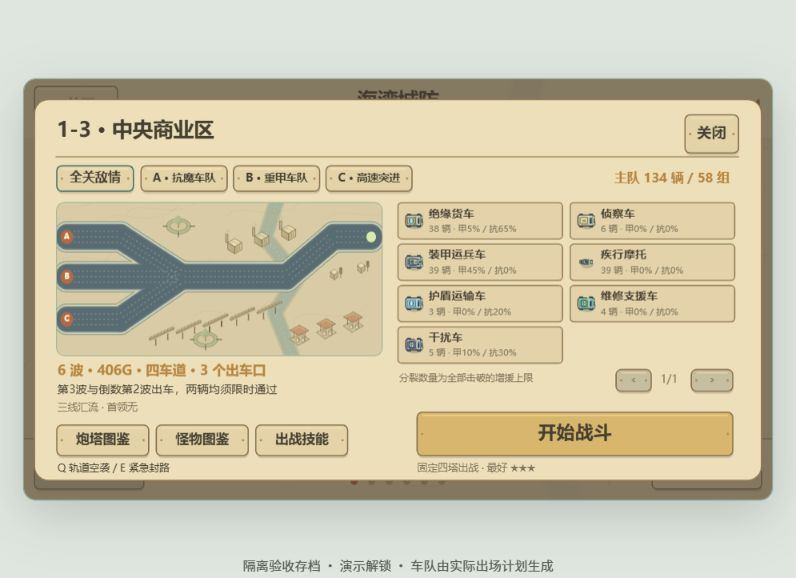
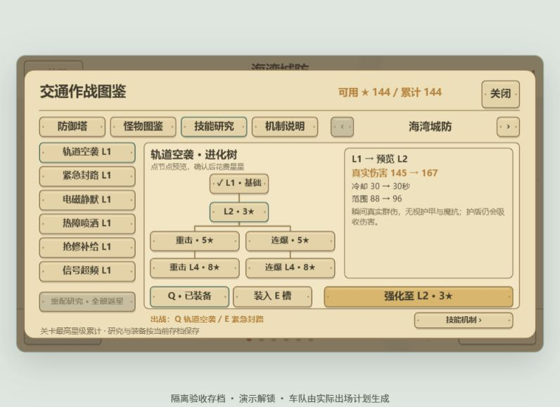

# 路网守卫 · Traffic Defense

HTML5 Canvas + 原生 JavaScript，无框架、无运行时外部服务依赖。当前网页版 **v0.16.0-web · 四车道与车组攻势**。后续默认只维护网页版；微信包冻结在 **v0.13.0**。

## 运行

用现代浏览器直接打开根目录 `index.html`，或在项目目录启动本地网页服务。游戏不需要安装依赖。源码已拆分，移动或上传游戏时需要一并携带 `src/` 和 `assets/`。

网页沿用交通图册界面与地图：先进入首页，选择开始游戏、读取存档或退出游戏；新建和读取均打开三个独立存档位，展示建立日期和进度。进入章节地图，点击路牌查看作战简报，再点“开始战斗”。六章地貌、四塔造型与铁链进化锁保留；v0.14起网页版独立调整交通任务与难度。

网页默认使用居中的 **960×540 游戏窗口**，四周留白，小窗口自动等比缩小。需要时可点击“全屏”或按 F 铺满屏幕；调整窗口只缩放画面，不改变地图、射程、金币和战斗进度。鼠标点地块建造、点塔升级，面板靠近所选设施并避开窗口边缘，悬停建造卡片可预览射程。切换标签页或窗口失焦会自动暂停战斗，返回后点击“继续”。退出游戏会停止声音并显示退出页，可自行关闭标签页，也能返回首页；浏览器本地存档保留。

`wechat/` 保留可导入的 v0.13.0 工程，本轮不修改、不重建、不上传。网页修改后直接刷新即可，勿重建微信包。微信存档与浏览器存档彼此独立。历史手机说明见 [微信开发说明](docs/WECHAT.md)。

## 战役与操作

- 六种地貌，每章八关，共 **48 关、402 波、12 场首领战**；每章第4、8关在最终波出现本章首领。
- 48关逐关设计路线：回旋、三线汇流、南北夹击、回旋、蛇形等；各章保留独立地貌与敌情。
- 部分关卡有2–3个独立出车口，分别偏重甲、抗魔、高速或支援。战前简报可切换「全关敌情」和A/B/C出车口，查看地图、各类敌车的计划数量、护甲与魔抗；分裂增援上限和公交站点伏击另列。
- 所有道路改成四车道：普通车各占一条，首领占中间两条并带两翼护卫。普通车组一次并排进入最多4辆，相隔约2.8–3.2秒再出下一组；高速出车口的快车可按0.48秒计划间隔连续进入。各出车口独立调度，同车道保持车距，其他车道仍能通过。
- 每关布置密集的 **固定建造空地**；城市路肩、乡村土坪、沙漠埋石、丘陵岩台、海岛木栈台与森林苔地随地貌绘制，去掉常驻方框、加号和编号。道路旁的小勘测桩或栈台提示位置，悬停或选中时才显示金色边线。先点空地，再选塔型；点击已有塔，在塔旁升级、选择专精、切换索敌或出售。
- 固定四种基础塔：路卫塔、信号站、清障台、勤务站，从第一关全部可用，同种可建多座。战役界面的进化图鉴显示本章研究条件与四级造型。
- 每种塔四级，两条互斥专精：一级→基础强化→选择专精→专精强化。出售返还总投入70%。
- 共33种敌人，含六种首领、分裂子单位、任务专属车及绝缘货车、解控指挥车、干扰车、破障推土车。图鉴按章节查看护甲、魔抗、生命和反制方法；支援优先会优先锁定治疗、解控及封塔单位。
- 全战役最多144星；至少18生命三星，至少12生命二星，存活通关一星。

## 作战图鉴与星星研究

章节地图底部的「作战图鉴」分为防御塔、怪物图鉴、技能研究、机制说明。关卡简报也有对应入口；战斗菜单可以查阅，打开时暂停。战斗中不能更换或强化技能。

- **防御塔**：切换六章、四塔、两条进化和L1–L4，简洁展示物理/魔法攻击、攻速、射程、标签及一句定位。数值直接读取战斗属性，队员按单人显示；进化预览不提前解锁。
- **怪物**：保留生命、护甲、魔抗、速度和两条主要克制建议，详细能力放入「机制详情」。后续波次生命按关卡倍率及 `1.15^(波次−1)` 增长。
- **机制说明**：单独解释锁定、穿甲、贯穿、群伤、减速、冻结、烧伤、疗伤、解控、封塔、车组与车道等16个主题；从单位页进入时展示该单位的完整机制及数值。
- **技能研究树**：基础L1→强化L2→两条互斥L3进化→各自L4终阶。点击节点只预览，确认按钮才扣星；右侧比较数值、冷却和范围，已研究节点打勾，另一分支锁定。仍可六选二装备Q/E，并免费返星重配。
- **伤害规则**：物理受护甲减免，魔法受魔抗减免，真实伤害忽略两者；护盾仍优先吸收。穿甲忽略物理护甲，贯穿额外命中直线后方车辆，两者分别计算。烧伤为魔法伤害，额外受抗火影响，不叠层。
- **组合反制**：装甲车用信号站或穿甲进化；高魔抗用路卫塔/清障台。治疗车可被静默，接受治疗的车辆可被禁疗；解控与干扰车需要支援优先集火或静默。免控车无法冻结/减速，但勤务队员仍能实体拦截。

四塔二级与四级分别采用不同成长；路卫塔和勤务站的第二分支获得禁疗，信号站第二分支获得静默，部分单目标远程路卫进化获得三车贯穿。原有章节灼烧、破盾、削甲、连锁、群伤、修复与再生继续生效。具体倍率见 [设施设计说明](docs/TOWER-DESIGN.md)。新特殊敌车从第一章第三关起加入适用章节的每三个波次，前两关留作教学。

### 六选二的支援技能

下表是1-1的一级数值；图鉴展示所选章节的参考值及升级前后对比。空袭和电磁伤害随章节与关内序号增长，热障伤害随章节增长。

| 技能 | 一级数值与作用 | 三级二选一 |
| --- | --- | --- |
| 轨道空袭 | 145真实群伤，范围88，冷却30秒 | 重击：伤害更高、范围缩小；连爆：范围扩大、冷却缩短 |
| 紧急封路 | 冻结3秒，范围105，冷却36秒 | 冰封：冻结5秒；缓行：短冻结并附加持续减速 |
| 电磁静默 | 80魔法群伤、破盾×3，静默/抑制回盾5秒；范围112，冷却32秒 | 强脉冲：增伤、破盾×5；长静默：静默8秒、范围扩大 |
| 热障喷洒 | 每秒24魔法烧伤，区域保持6秒、离区余火2秒；范围96，冷却34秒 | 烈焰：更强烧伤；黏胶：减速、区域保持9秒 |
| 抢修补给 | 修复公交/桥梁32、队员96；解除并免疫封塔6秒，范围150，冷却40秒 | 急修：提高修复量；屏障：更长免封塔保护、更大范围 |
| 信号超频 | 塔与队员攻速+35%，持续7秒，范围150，冷却38秒 | 极速：+70%攻速6秒；续航：+40%攻速13秒、更大范围 |

图鉴中将任意两个不同技能装入 **Q/E槽**，下局生效。技能升级为永久研究：L1→L2花3星，L2→L3选分支花5星，L3→L4花8星。可用星星是「所有关卡最高星级总和 − 研究花费」，不会降低地图星级，也不能重复刷同一成绩获得星星。每个存档独立保存研究和装备；「重配研究」免费返还全部研究花费，保留技能槽，允许重新尝试分支。

## 交通调度与关卡任务

每章第1/5关守收费站、第2/6关护送公交、第3/7关保障急救通道、第4/8关保护桥梁，四类任务各12关。海岛民用车以客渡/救援船造型出现。所有任务都需完成全部波次并保住生命；公交或急救车辆尚未送达时不会提前结算胜利。

| 任务 | 规则与操作 |
| --- | --- |
| 收费站 | 敌车漏过会额外损伤收费设施；耐久归零失败。「落杆拦截」在出口拦停车辆2.5秒，冷却20秒。 |
| 公交撤离 | 第2波和倒数第2波各出一辆，必须全部安全送达。每辆停靠两站，各接人4秒；站点提前3秒预警两辆劫掠车伏击。「护航」保护5秒，冷却14秒；冻结或队员拦截也能阻止敌车伤害公交。 |
| 急救通道 | 第3波和倒数第2波各出一辆，必须全部限时送达。前方同一通行带的敌车会阻挡；「优先放行」绕过阻挡8秒，冷却18秒。时限按出发道路长度计算，改道不重置。 |
| 桥梁保护 | 敌车驶入实际桥面造成撞击，桥面上的载重持续损伤结构；破拆车停桥破拆7秒，每秒额外损伤4点，冻结/队员拦截能阻止破拆。耐久归零失败。「抢修」花60G恢复30点耐久，冷却18秒。 |

**公交需要提前布防接人站。** 待发后有12秒部署时间，可点击「发车」提前出站，到时自动发车；两辆依次撤离。公交送达奖励 `80 + 向下取整(剩余车况 × 0.8)` 金币，并使两个支援技能各减少8秒冷却。保护较好的公交能提供更多后续建设资金；无保护时可能在伏击中被摧毁。民车出发时选择风险较低的线路，沿途不会被敌流调度带走。

**手动分流关卡：1-1、2-2、3-2、4-2、5-2、6-2。** 默认敌车自动分散到各路。点击路口绿色指示牌或底部「分流调度」，直接选择A快线、B慢线或C常规线，将岔口前的敌车和随后出现的敌车集中到该线 **8秒**，之后恢复自动分路；从操作起冷却18秒。已过路口车辆和民用车辆继续原路。分岔段在道路因子上分别乘以1.18、0.76、1：慢线延长火力时间，快线可快速引入已布置的火力区；公交撤离时可把敌流引到另一条线路。路牌不会夺走附近建造空地的中心点击区域。

**桥梁从第2波起面临破拆车。** 每个偶数波额外来一辆，第6波起的偶数波来两辆。新旧路线的桥面分别按车辆实际位置检测，变道后的新桥也会受损；地图显示桥梁血条、裂纹、破拆提示，顶部显示实时损伤速度，低于40%发出警报。抢修与升级共用金币，需要提前安排控制和火力；桥外没有凭空扣血。

道路影响所有车辆的基础速度：快速路×1.18、城区路×1、砂石路×0.85、沙地×0.9、坡道×0.88、窄桥×0.82、航道×1.08。重装敌车在砂石路降为×0.75，在沙地/坡道降为×0.72；接近明显转弯再乘0.8。限速牌和不同路面用于识别路段类型，图上数字是道路标识，不是像素速度。减速塔效果在道路速度之后叠加。

## 定时进攻与难度

首波默认准备20秒；之后从上一波最后一辆车实际进入地图开始计时，等待 **5–10秒** 自动发动下一波，**不等待场上敌人被消灭**。上波不超过10个敌人时等5秒，每多1个增加0.25秒，最多10秒。最后一波发动后，必须消灭所有已生成、排队和分裂出来的敌人才能获胜。

本波全部出场后可提前迎敌，不能连续点击发完全部波次。**只有提前发动才有额外金币**：剩余等待秒数×3向上取整，上限30G，首波同样计算；例如提前8秒获得24G、提前3秒获得9G。自动发波奖励为0，击杀奖励照常。按钮实时显示当前可得奖励；排队单位保留所属波次的生命倍率。

v0.16相对v0.15，普通敌人生命约+7%、首领约+8%（当前倍率1.55/2.1），逐波成长保持1.15。普通车每波再增加2辆，每多一个出车口再增加2辆；以并排车组形成集中攻势。桥梁破拆队、首领护卫和公交伏击另计。击杀金币保持原奖励的90%并取整。独立终点每多一处补充350G初始布防预算，便于建立两条防线，敌军数量不减少。重甲、抗魔及支援车队需要不同火力组合。

后期保留装甲、护盾、速度、抗控与分裂压力。车辆入口留出车距，同路快车跟随慢车；后车可绕过被队员拦截或被定身的目标，避免一名队员锁住整波。分裂子车沿来路错开出场。维修单位占比较低且逐步加入。初始金币也随进度增加，用于部署基础塔与已研究的章节专精。暂停、图鉴和后台状态会暂停模拟时间；倍速同时加快战斗、技能冷却和波次计时。

## 战斗途中变道

每章第4关在第4波、第8关在第5波触发一次变道，共12处事件：高架施工、隧道封闭、潮汐车道切换、吊桥开启绕行。选关缩略图与战场黄色虚线提前展示未来路线；上一波开始时播报交通预告，事件前一波出场结束后显示倒计时；波次到达时自动切换，也支持提前发波触发。封闭处显示道闸或设施变化，已经进入旧路的车获准驶离。

尚未经过分岔口的车辆走新路，已经驶入旧路的车继续前进，旧路显示为灰色，分裂子单位沿父车路线移动。建造地块预先避开两套道路，不会吞掉已建塔；请提前覆盖新路并调动勤务站集合点。

## 六种地貌

| 章节（各8关） | 地形与路网 | 特色敌情 | 本章首领 |
| --- | --- | --- | --- |
| 海湾城防 | 城市街区、港口、交通枢纽 | 装甲、护盾、维修车队 | 攻城巨兽 |
| 田野追击 | 麦田、风车、灌渠、乡间分流 | 农用装甲车、灌溉维修车 | 收割者巨机 |
| 沙海远征 | 沙丘、绿洲、岩丘、蜿蜒商道 | 高速越野、抗火与护盾 | 沙海堡垒 |
| 群山要塞 | 山脊、矿口、折返盘山路 | 高装甲、抗控制履带车 | 山岳破城车 |
| 海岛封锁 | 岛礁、灯塔、水上航道 | 快艇、护盾舰、补给舰、母舰 | 深海旗舰 |
| 古林守望 | 古树、溪谷、多入口林间岔路 | 治疗、母巢分裂、孢子兽 | 古树行者 |

沙漠越野车抵抗持续灼烧，丘陵履带车兼有装甲与抗控制，海岛母舰释放高速小艇，森林母巢释放孢子兽。不同章节需要重新安排火力、队员集合点与进化方向。

## 四种塔、守卫与48条地貌进化

| 基础塔 | 作用 | 城市的两条进化 |
| --- | --- | --- |
| 路卫塔 · 80G | 连续锁定同车增伤，换目标重置 | 测速塔 / 追踪塔 |
| 信号站 · 125G | 周期性魔法范围脉冲，干扰减速 | 冷却塔 / 电网塔 |
| 清障台 · 145G | 绞盘抛射制动锚，范围伤害并短暂减速 | 重锚台 / 双网台 |
| 勤务站 · 110G | 派出3名拦截队员，驻路拦车 | 盾卫站 / 快反站 |

拦截队员会从勤务站走到道路上的集合点，实际接近后才会阻挡车辆。每人只能拦一辆车，敌人会反击，首领反击更强；阵亡后免费补员。点击勤务站，再点“设置集合点”，即可在勤务站范围内的道路上调动队员。海岛章节的队员使用小舟驻守航道。出售、调动或死亡会解除拦截。

每种设施在每种地貌有两条专属路线，共 **6 × 4 × 2 = 48条进化**：乡村偏分流与补给，沙漠偏冷却与破盾，丘陵偏共振与穿甲，海岛偏海缆跳频与舰队拦截，森林偏感应控制、净空与再生。

乡村水泵塔定时修复附近存活队员；丘陵碎甲塔和震地塔削弱装甲，让其他塔也受益；海岛灯塔和寒潮塔阻止护盾再生。其他路线继续区分穿甲、多目标、灼烧、连锁、减速、补员和再生。

**永久研究与局内升级分开计算**：通关获得某条进化资格，每次战斗仍要花金币升级到二级，再选择已研究的路线升三级，最后可强化至四级。两条路线本局互斥。

- 第一章：路卫、信号、清障设施、勤务站的路线Ⅰ分别在累计通关1、2、3、4关研究完成；路线Ⅱ分别在4、5、6、7关完成。
- 后续章节：进入新章即获得四塔的本章路线Ⅰ；本章再通关2、3、4、5关，分别研究四塔的路线Ⅱ。
- 重玩已通关关卡不增加研究进度；升级菜单显示精确通关要求。已通关存档会自动获得对应资格。
- 新造型统一为圆角机壳、深色玻璃和工业灯带；从单体设备逐步增加双拦截轨、路口灯阵、重锚吊臂、双网绞盘和巡逻车库。章节设备改变外轮廓：城市信号杆/路障、乡村风车/水箱、沙漠光板/散热片、丘陵支架/履带、海岛浮筒/船锚、森林根须/荧光果。进化图鉴可切换六章和两条路线预览，预览不提前解锁。
- 拦截队员的绘制比例缩小为原来的64%，改穿护目头盔和反光背心；血条保持清晰，生命与拦截距离不因外观缩小而改变。集合点改为道路信标。

## 攻击动画与射程

升级改变发射、飞行和命中表现：路卫塔增加后坐、双轨弹迹或带环粗束；信号站有双环波阵、连锁电弧或聚能光束；清障台有更高的重锚抛物线、辐射拉索或双网交织；勤务队员有盾击冲击面与多段斩迹。四级加粗核心弹迹、增加爆点与波阵节点，配色随章节和专精变化。

基础射程调整为路卫塔125、信号站108、清障台132、勤务站125（此前为145、125、155、145），约缩小14%–15%。二级射程加成改为10、四级追加6，远程专精加成也适度缩小。勤务站集合范围与界面预览一致；连锁跳跃距离和爆炸半径保持各自的能力参数。

动画不额外增加伤害；暂停时定格，倍速时同步加快。升级不会改变已经发射的弹体外观与伤害。

## 声音

使用原生 Web Audio 合成建造、升级、路卫点射、信号干扰、制动锚清障、接触拦截、波次、漏怪、技能和胜负提示，并加入六首旋律、节奏和音色均独立的循环配乐：城市《街灯》（112 BPM电子节拍）、乡村《麦风》（94 BPM拨弦）、沙漠《沙影》（82 BPM慢拍）、丘陵《山行》（104 BPM低音行进）、海岛《潮歌》（90 BPM三拍）、森林《萤火》（72 BPM稀疏铃音）。首次点击或按键后启用；顶部“音效”和“音乐”分别开关，偏好自动保存。后台、暂停和弹窗时停止配乐与已有声音；音效限制同时发声数量和触发频率，防止大规模战斗叠音。音乐不随战斗倍速加速，切换章节会从新曲开头播放。按 M 可直接开关音乐。交通音效增加低音发动机、重车制动、道闸双音与六段中文广播；发动机音量随车辆距地图下方中央听点的距离改变，只保留一个环境声源。广播只在民用车辆派出及事件预告时播放，和环境声一起遵守音效开关、暂停及后台状态。广播使用本机中文语音离线生成，WAV随项目保存于 assets/audio，无需在线语音服务。

## 快捷操作

| 操作 | 功能 |
| --- | --- |
| 鼠标左键 | 选关、点地块建塔、点塔升级、选择单位 |
| 右键 / Esc | 收起菜单、取消选择；Esc关闭弹窗 |
| 1–4 | 选中空地块后，建造塔组对应塔型 |
| 空格 | 暂停 / 继续，暂停时可建造和升级 |
| Q，再点地图 | 使用图鉴中装备的第一个技能，默认轨道空袭 |
| E，再点地图 | 使用图鉴中装备的第二个技能，默认紧急封路 |
| 顶部速度按钮 | 1 / 2 / 3倍速 |
| 勤务站菜单 → 设置集合点 | 点击射程内道路调动队员 |
| 首页 / 战斗菜单的音效、音乐按钮 | 独立开关声音，保存偏好 |
| M | 开关背景音乐 |
| F / 全屏按钮 | 进入或退出浏览器全屏 |

没有适用目标时不消耗冷却。热障允许在道路上预铺，抢修/超频需要范围内有对应设施、队员或目标；抗控缩短冻结，免控拒绝冻结与减速。

## 美术与设施设计

车辆造型缩小至原来的80%，单辆普通车的宽度可放进一条车道，保留装甲接缝、轮胎纹路、玻璃反光、灯组及章节专用设备；详细绘制在 `src/render/vehicles.js`。道路同步加宽，车道线、收费栏杆、桥栏和隧道设施随宽度调整；路边地块重新规划，避开新旧道路。

本版采用交通应急设施主题：路侧拦截设备、红绿灯信号站、清障绞盘吊臂、巡逻勤务车库。所有造型、弹体和小队员由 Canvas 程序绘制。设施定位与进化设计详见 [设施设计说明](docs/TOWER-DESIGN.md)。

## 旧存档兼容

使用原来的本地存档键，迁移为 schema 4 三存档容器，**保留48关的最好星级与关卡进度**。旧单存档进入第一位，原版没有记录建立时间，因此标注“旧存档 · 原始日期未记录”。新存档记录首次建立时间，之后读取、通关都不改变这个日期；最多三份独立进度，覆盖只影响选定存档。旧14种塔和出战塔组由新的四种基础塔替代；已完成的关卡数自动转换为各章进化研究资格。局内金币、建筑和守卫不跨局保存。

v0.15将各存档内容迁移为schema 5，外层仍为三档schema 4容器，保留首次日期和星级，旧档默认装备空袭/封路、六技能均为一级。研究花费会按已有星星验证，损坏或超预算数据不会产生负余额。

存档保存在当前浏览器的localStorage，不上传服务器。不同网址、浏览器或本地文件位置的进度可能不互通。清除网站数据会清空进度，浏览器禁止存储时会提示本次进度仅在页面内保留。

## 文件管理

```text
index.html       游戏入口，双击运行
src/             原生 JavaScript 源码
  data/          设施、敌人、关卡与章节乐谱数据
  core/          碰撞、存档、音频和路网
  platform/      浏览器平台接口
  render/        地图界面与设施美术
wechat/          微信小游戏入口、平台适配、生成代码与音频
tools/           小游戏构建与音频生成脚本
assets/css/      页面样式
tests/           自动化测试
docs/            版本历史、开发与设施设计说明
  previews/
    current/     当前版本预览
    archive/     历史截图
```

常用参数在 `src/config.js`；设施属性与48条进化在 `src/data/towers.js`；建筑和小队员造型在 `src/render/facilities.js`。详细文件职责与加载约定见 [开发说明](docs/DEVELOPMENT.md)，版本历史见 [更新记录](docs/CHANGELOG.md)。

## 验证

日常运行 `node --test tests/game.test.cjs tests/browser.test.cjs`，覆盖玩法、三档流程、图鉴研究、鼠标建造升级、快捷键、窗口缩放、失焦暂停及全屏。浏览器适配测试保留章节、关卡身份和基础塔美术参数对照；路网、车道、塔属性、敌人、技能和交通规则在网页版独立验证，检查900×700到2560×1080等六种窗口尺寸。

手机冻结校验：`node --test --test-name-pattern="frozen v0.13.0" tests/wechat.test.cjs`。33个文件按哈希核对，不要求微信包追随新的网页源码，也不触发构建。

玩法测试覆盖射程边界、升级攻击、变道连续性、道路预留、章节能力、音轨、四类任务、守卫拦截、旧存档与48张地图绘制；逐关核对计划数量与实际出车，检查多入口同时发车、同车道排队、合流车距、首领占道及分裂间距。默认对开局与六章终关执行合法经济、真实定时波次的通关模拟，使用此前关卡可获得的星星研究技能；设置 `TD_TEST_STAGES` 为逗号分隔的0至47可选择验证关卡。

## 后续更新

本项目继续使用现有GitHub仓库 `jijingsong1-ops/traffic-defense`，网页更新提交到 `main`。已有版本标签保留；网页当前版本为 `v0.16.0-web`。

在本项目目录打开终端，修改文件后执行：

```powershell
git status
git add -A
git diff --cached --stat
git commit -m "更新网页版"
git push origin main
```


提交前检查暂存内容，勿加入个人配置、临时二维码和测试日志。发布新版本时，先更新网页中的版本号，再创建一个尚未使用过的标签；页面版本号不会自动创建Git标签，不要覆盖已有版本。

以下为隔离验收存档的界面示例，提供演示解锁；战场由实际出车计划推进3秒后暂停，不代表通关记录。






