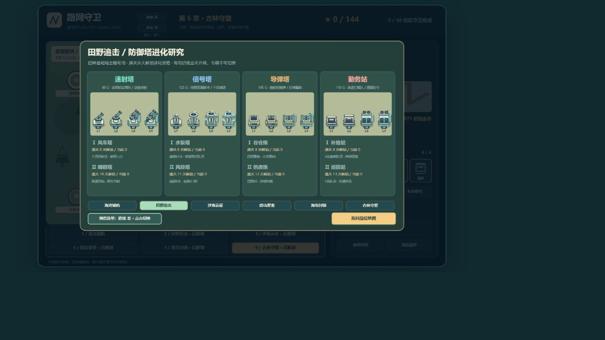
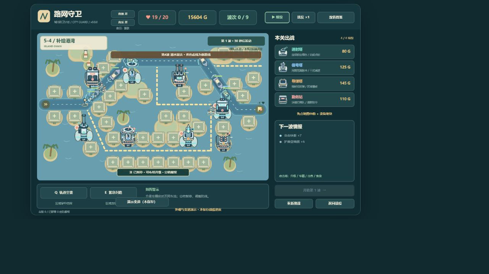
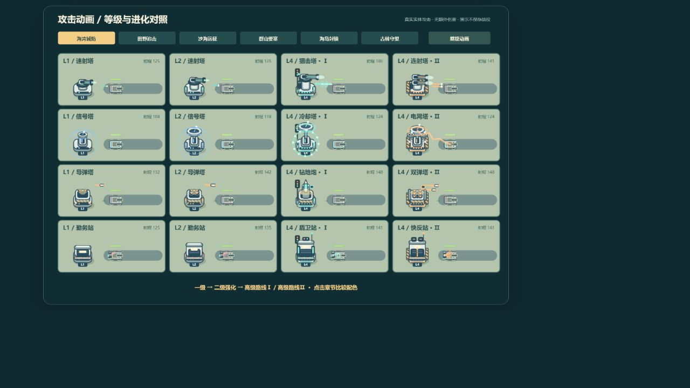

# 路网守卫 · Traffic Defense

HTML5 Canvas + 原生 JavaScript，无框架、无外部美术或音频依赖。当前版本 **v0.8.1 · 进化火力**。

## 运行

用现代浏览器直接打开根目录 `index.html`，或在项目目录启动本地网页服务。游戏不需要安装依赖。源码已拆分，移动或上传游戏时需要一并携带 `src/` 和 `assets/`。

## 战役与操作

- 六种地貌，每章八关，共 **48 关、402 波、12 场首领战**；每章第4、8关在最终波出现本章首领。
- 48关逐关设计路线：回旋、三线汇流、南北夹击、交叉、蛇形等；各章保留独立地貌与敌情。
- 每关 **31–59 处固定建造地块**；隐藏网格，不能在其他位置随意建造。先点地块，再选塔型；点击已有塔，在塔旁升级、选择专精、切换索敌或出售。
- 固定四种基础塔：速射塔、信号塔、导弹塔、勤务站，从第一关全部可用，同种可建多座。战役界面的进化图鉴显示本章研究条件与四级造型。
- 每种塔四级，两条互斥专精：一级→基础强化→选择专精→专精强化。出售返还总投入70%。
- 共27种敌人，含六种首领和分裂子单位。图鉴按地貌查看；支援优先会锁定所有具有治疗能力的敌人。
- 全战役最多144星；至少18生命三星，至少12生命二星，存活通关一星。

## 定时进攻与难度

首波默认准备30秒；之后每20–32秒自动发动下一波，间隔随章节和关卡逐渐缩短，**不等待场上敌人清空**。最后一波发动后，必须消灭所有已生成、排队和分裂出来的敌人才能获胜。

也可主动提前发动下一波。从第二波起，每次发动获得34金币补给，无论自动还是手动，每波只发放一次。排队单位保留所属波次的生命倍率，叠波时不会被后续波次倍率覆盖。

敌人生命逐波成长，后期加强装甲、护盾、速度、抗控与分裂压力。维修单位占比较低且逐步加入，避免整队无限治疗。初始金币也随进度增加，用于部署基础塔与已研究的章节专精。暂停、图鉴和后台状态会暂停模拟时间；倍速同时加快战斗、技能冷却和波次计时。

## 战斗途中变道

每章第4关在第4波、第8关在第5波触发一次变道，共12处事件：施工封路、麦田开道、流沙塌陷、落石封山、潮水退去、根桥生长等。选关缩略图与战场黄色虚线提前展示未来路线；波次到达时自动切换，也支持提前发波触发。

尚未经过分岔口的车辆走新路，已经驶入旧路的车继续前进，旧路显示为灰色，分裂子单位沿父车路线移动。建造地块预先避开两套道路，不会吞掉已建塔；请提前覆盖新路并调动勤务站集合点。

## 六种地貌

| 章节（各8关） | 地形与路网 | 特色敌情 | 本章首领 |
| --- | --- | --- | --- |
| 海湾城防 | 城市街区、港口、交通枢纽 | 装甲、护盾、维修车队 | 攻城巨兽 |
| 田野追击 | 麦田、风车、灌渠、乡间分流 | 农用装甲车、灌溉维修车 | 收割者巨机 |
| 沙海远征 | 沙丘、绿洲、岩丘、蜿蜒商道 | 高速越野、抗火与护盾 | 沙海堡垒 |
| 群山要塞 | 山脊、矿口、折返盘山路 | 高装甲、抗控制履带车 | 山岳破城车 |
| 海岛封锁 | 岛礁、灯塔、水上航道 | 快艇、护盾舰、补给舰、母舰 | 深海旗舰 |
| 古林守望 | 古树、溪谷、多入口林间岔路 | 治疗、母巢分裂、孢子兽 | 古树行者 |

沙漠越野车抵抗持续灼烧，丘陵履带车兼有装甲与抗控制，海岛母舰释放高速小艇，森林母巢释放孢子兽。不同章节需要重新安排火力、队员集合点与进化方向。

## 四种塔、守卫与48条地貌进化

| 基础塔 | 作用 | 城市的两条进化 |
| --- | --- | --- |
| 速射塔 · 80G | 连续锁定同车增伤，换目标重置 | 狙击塔 / 连射塔 |
| 信号塔 · 125G | 周期性穿甲范围脉冲，干扰减速 | 冷却塔 / 电网塔 |
| 导弹塔 · 145G | 巡航弹爆破，弹体带抛射尾焰 | 钻地炮 / 双弹塔 |
| 勤务站 · 110G | 派出3名拦截队员，驻路拦车 | 盾卫站 / 快反站 |

拦截队员会从勤务站走到道路上的集合点，实际接近后才会阻挡车辆。每人只能拦一辆车，敌人会反击，首领反击更强；阵亡后免费补员。点击勤务站，再点“设置集合点”，即可在勤务站范围内的道路上调动队员。海岛章节的队员使用小舟驻守航道。出售、调动或死亡会解除拦截。

每种设施在每种地貌有两条专属路线，共 **6 × 4 × 2 = 48条进化**：乡村偏分流与补给，沙漠偏冷却与破盾，丘陵偏共振与穿甲，海岛偏海缆跳频与舰队拦截，森林偏感应控制、净空与再生。

乡村水泵塔定时修复附近存活队员；丘陵碎甲塔和震地塔削弱装甲，让其他塔也受益；海岛灯塔和寒潮塔阻止护盾再生。其他路线继续区分穿甲、多目标、灼烧、连锁、减速、补员和再生。

**永久研究与局内升级分开计算**：通关获得某条进化资格，每次战斗仍要花金币升级到二级，再选择已研究的路线升三级，最后可强化至四级。两条路线本局互斥。

- 第一章：磁轨、信号、导弹设施、勤务站的路线Ⅰ分别在累计通关1、2、3、4关研究完成；路线Ⅱ分别在4、5、6、7关完成。
- 后续章节：进入新章即获得四塔的本章路线Ⅰ；本章再通关2、3、4、5关，分别研究四塔的路线Ⅱ。
- 重玩已通关关卡不增加研究进度；升级菜单显示精确通关要求。已通关存档会自动获得对应资格。
- 新造型统一为圆角机壳、深色玻璃和工业灯带；从单体设备逐步增加双导轨、圆盘天线、垂直弹舱、能源侧舱和车库模块。章节设备改变外轮廓：城市信号杆/路障、乡村风车/水箱、沙漠光板/散热片、丘陵支架/履带、海岛浮筒/船锚、森林根须/荧光果。进化图鉴可切换六章和两条路线预览，预览不提前解锁。
- 拦截队员的绘制比例缩小为原来的64%，改穿护目头盔和反光背心；血条保持清晰，生命与拦截距离不因外观缩小而改变。集合点改为道路信标。

## 攻击动画与射程

升级改变发射、飞行和命中表现：速射塔增加后坐、双轨弹迹或带环粗束；信号塔有双环波阵、连锁电弧或聚能光束；导弹塔有更高的重弹抛物线、同心冲击波或双弹齐射爆点；勤务队员有盾击冲击面与多段斩迹。四级加粗核心弹迹、增加爆点与波阵节点，配色随章节和专精变化。

基础射程调整为速射塔125、信号塔108、导弹塔132、勤务站125（此前为145、125、155、145），约缩小14%–15%。二级射程加成改为10、四级追加6，远程专精加成也适度缩小。勤务站集合范围与界面预览一致；连锁跳跃距离和爆炸半径保持各自的能力参数。

动画不额外增加伤害；暂停时定格，倍速时同步加快。升级不会改变已经发射的弹体外观与伤害。

## 声音

使用原生 Web Audio 合成建造、升级、磁轨射击、信号干扰、导弹爆破、接触拦截、波次、漏怪、技能和胜负提示，并加入六首旋律、节奏和音色均独立的循环配乐：城市《街灯》（112 BPM电子节拍）、乡村《麦风》（94 BPM拨弦）、沙漠《沙影》（82 BPM慢拍）、丘陵《山行》（104 BPM低音行进）、海岛《潮歌》（90 BPM三拍）、森林《萤火》（72 BPM稀疏铃音）。首次点击或按键后启用；顶部“音效”和“音乐”分别开关，偏好自动保存。后台、暂停和弹窗时停止配乐与已有声音；音效限制同时发声数量和触发频率，防止大规模战斗叠音。音乐不随战斗倍速加速，切换章节会从新曲开头播放。按 M 可直接开关音乐。无需下载任何音频资源。

## 快捷操作

| 操作 | 功能 |
| --- | --- |
| 鼠标左键 | 选关、点地块建塔、点塔升级、选择单位 |
| 右键 / Esc | 收起菜单、取消选择；Esc关闭弹窗 |
| 1–4 | 选中空地块后，建造塔组对应塔型 |
| 空格 | 暂停 / 继续，暂停时可建造和升级 |
| Q，再点地图 | 轨道空袭，穿甲区域伤害，冷却30秒 |
| E，再点地图 | 紧急封路，冻结区域敌人3秒，冷却36秒 |
| 顶部速度按钮 | 1 / 2 / 3倍速 |
| 勤务站菜单 → 设置集合点 | 点击射程内道路调动队员 |
| 顶部音效 / 音乐按钮 | 独立开关声音，保存偏好 |
| M | 开关背景音乐 |

技能范围没有敌人时不消耗冷却。抗控敌人会缩短冻结时间。

## 美术与设施设计

本版采用交通应急设施主题：磁轨转台、信号天线、巡航发射舱、勤务车库。所有造型、弹体和小队员由 Canvas 程序绘制。设施定位与进化设计详见 [设施设计说明](docs/TOWER-DESIGN.md)。

## 旧存档兼容

使用原来的本地存档键，迁移为 schema 3，**保留48关的最好星级与关卡进度**。旧14种塔和出战塔组由新的四种基础塔替代；已完成的关卡数自动转换为各章进化研究资格。局内金币、建筑和守卫不跨局保存。

存档保存在当前浏览器的localStorage，不上传服务器。不同网址、浏览器或本地文件位置的进度可能不互通。清除网站数据会清空进度，浏览器禁止存储时会提示本次进度仅在页面内保留。

## 文件管理

```text
index.html       游戏入口，双击运行
src/             原生 JavaScript 源码
  data/          设施、敌人、关卡与章节乐谱数据
  core/          碰撞、存档、音频和路网
  render/        地图界面与设施美术
assets/css/      页面样式
tests/           自动化测试
docs/            版本历史、开发与设施设计说明
  previews/
    current/     当前版本预览
    archive/     历史截图
```

常用参数在 `src/config.js`；设施属性与48条进化在 `src/data/towers.js`；建筑和小队员造型在 `src/render/facilities.js`。详细文件职责与加载约定见 [开发说明](docs/DEVELOPMENT.md)，版本历史见 [更新记录](docs/CHANGELOG.md)。

## 验证

运行 `node --test tests/game.test.cjs`。53项测试覆盖射程边界、攻击动画快照、动画与伤害分离、暂停定格、变道路径连续性、未来道路建造预留、章节路线差异、修复/削甲/抑制护盾、独立乐谱与分通道静音，以及信号范围脉冲、磁轨连续锁定增伤、空地块点击优先级、48条专精、队员实体拦截/补员/集合点/出售释放、声音与旧存档，以及48张地图渲染。默认对开局与六章终关执行合法经济、真实定时波次的通关模拟；本次额外将模拟扩展到全部48关，均通过。

## 后续更新

在本项目目录打开终端，修改文件后执行：

```powershell
git status
git add -A
git diff --cached --stat
git commit -m "v0.8.1: 进化攻击动画与射程调整"
git push
git tag -a v0.8.1 -m "进化火力"
git push origin v0.8.1
```


这次包含文件移动，`git add -A` 会同时记录新路径和旧路径删除；提交前检查暂存内容。


版本标签示例请按实际发布版本替换；页面版本号不会自动创建Git标签。







