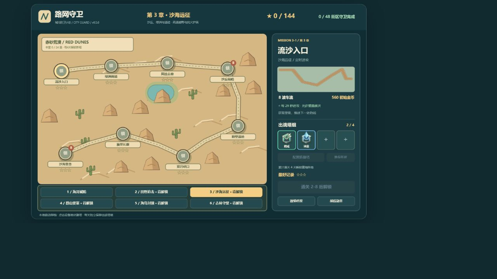
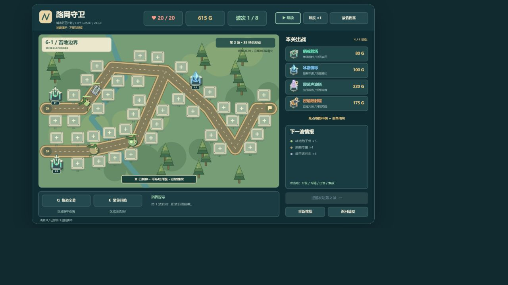
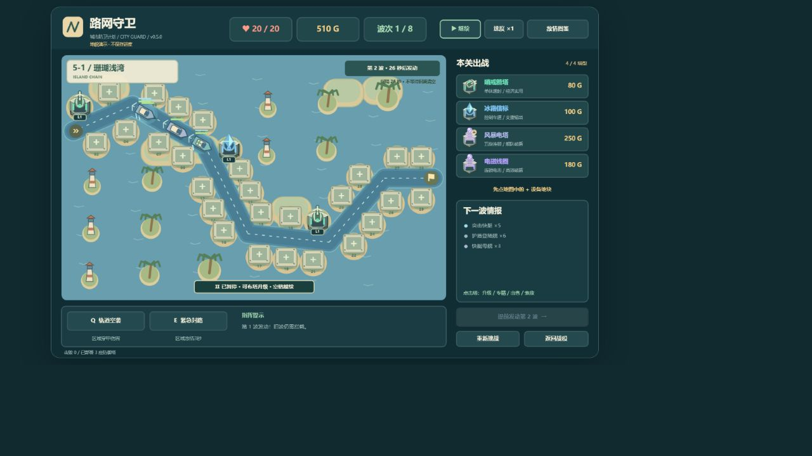

# 路网守卫 · Traffic Defense

HTML5 Canvas + 原生 JavaScript，无框架、无外部美术依赖。当前版本 **v0.5.0 · 六境远征**。

## 运行

用现代浏览器直接打开 `index.html`，或在项目目录启动本地网页服务。游戏不需要安装依赖。

## 战役与操作

- 六种地貌，每章八关，共 **48 关、402 波、12 场首领战**；每章第4、8关在最终波出现本章首领。
- 各章有独立的选关图形、路线结构与地貌装饰，每关使用不同路网。
- 每关 **28–58 处固定建造地块**；隐藏网格，不能在其他位置随意建造。先点地块，再选塔型；点击已有塔，在塔旁升级、选择专精、切换索敌或出售。
- 每关最多携带四种已解锁塔型，同种可建多座。塔库分三页，提供推荐阵容、费用与解锁条件。
- 每种塔四级，两条互斥专精：一级→基础强化→选择专精→专精强化。出售返还总投入70%。
- 共27种敌人，含六种首领和分裂子单位。图鉴按地貌查看；支援优先会锁定所有具有治疗能力的敌人。
- 全战役最多144星；至少18生命三星，至少12生命二星，存活通关一星。

## 定时进攻与难度

首波默认准备30秒；之后每20–32秒自动发动下一波，间隔随章节和关卡逐渐缩短，**不等待场上敌人清空**。最后一波发动后，必须消灭所有已生成、排队和分裂出来的敌人才能获胜。

也可主动提前发动下一波。从第二波起，每次发动获得34金币补给，无论自动还是手动，每波只发放一次。排队单位保留所属波次的生命倍率，叠波时不会被后续波次倍率覆盖。

敌人生命逐波成长，后期加强装甲、护盾、速度、抗控与分裂压力。维修单位占比较低且逐步加入，避免整队无限治疗。初始金币也随进度增加，用于购买已解锁的反制塔型。暂停、图鉴和后台状态会暂停模拟时间；倍速同时加快战斗、技能冷却和波次计时。

## 六种地貌

| 章节（各8关） | 地形与路网 | 特色敌情 | 本章首领 |
| --- | --- | --- | --- |
| 海湾城防 | 城市街区、港口、交通枢纽 | 装甲、护盾、维修车队 | 攻城巨兽 |
| 田野追击 | 麦田、风车、灌渠、乡间分流 | 农用装甲车、灌溉维修车 | 收割者巨机 |
| 沙海远征 | 沙丘、绿洲、岩丘、蜿蜒商道 | 高速越野、抗火与护盾 | 沙海堡垒 |
| 群山要塞 | 山脊、矿口、折返盘山路 | 高装甲、抗控制履带车 | 山岳破城车 |
| 海岛封锁 | 岛礁、灯塔、水上航道 | 快艇、护盾舰、补给舰、母舰 | 深海旗舰 |
| 古林守望 | 古树、溪谷、多入口林间岔路 | 治疗、母巢分裂、孢子兽 | 古树行者 |

沙漠越野车抵抗持续灼烧，丘陵履带车兼有装甲与抗控制，海岛母舰释放高速小艇，森林母巢释放孢子兽。不同章节需要重新搭配塔组。

## 防御塔解锁与28条专精

初始开放箭塔、冰霜塔。**每累计通关4个不同关卡解锁一种新塔**，重复刷同一关不会额外计数；第48关解锁日冕光核，可用于重玩和争取三星。

| 塔型 | 累计通关条件 | 专精一 | 专精二 |
| --- | --- | --- | --- |
| 哨戒箭塔 | 初始 | 鹰眼狙击 | 疾风连弩 |
| 冰霜信标 | 初始 | 极寒禁锢 | 暴风雪域 |
| 重炮阵地 | 4关 | 破城重炮 | 燃烧迫击炮 |
| 电磁线圈 | 8关 | 雷霆连锁 | EMP 干扰 |
| 棱镜光塔 | 12关 | 聚焦灼光 | 折射棱镜 |
| 远程迫击炮 | 16关 | 集束弹幕 | 重型榴弹 |
| 烈焰喷射塔 | 20关 | 白磷燃烧 | 熔岩喷流 |
| 腐蚀喷雾塔 | 24关 | 强酸雾幕 | 黏液封锁 |
| 震荡声波塔 | 28关 | 共振碎甲 | 余震回响 |
| 电磁轨道炮 | 32关 | 超载贯穿 | 速射轨道 |
| 风暴电塔 | 36关 | 雷暴天幕 | 离子风暴 |
| 重力场发生器 | 40关 | 奇点坍缩 | 时间囚笼 |
| 蜂群哨戒站 | 44关 | 猎杀编队 | 精英僚机 |
| 日冕光核 | 48关 | 耀斑爆发 | 双星烈光 |

## 快捷操作

| 操作 | 功能 |
| --- | --- |
| 鼠标左键 | 选关、点地块建塔、点塔升级、选择单位 |
| 右键 / Esc | 收起菜单、取消选择；Esc关闭弹窗 |
| 1–4 | 选中空地块后，建造塔组对应塔型 |
| 空格 | 暂停 / 继续，暂停时可建造和升级 |
| Q，再点地图 | 轨道空袭，穿甲区域伤害，冷却30秒 |
| E，再点地图 | 紧急封路，冻结区域敌人3秒，冷却36秒 |
| 顶部速度按钮 | 1 / 2 / 3倍速 |

技能范围没有敌人时不消耗冷却。抗控敌人会缩短冻结时间。

## 画风与设计参考

参考[《王国保卫战》官方作品介绍](https://play.kingdomrush.com/kingdom-rush)：固定塔位、局内专精、敌人克制和地貌战役。视觉采用程序绘制的卡通轮廓、分层阴影、石砌塔基、沙丘、风车、山峰、灯塔与森林怪物，保留交通路网主题。全部画面由Canvas绘制。

## 旧存档兼容

使用原来的本地存档键，自动迁移至新版结构。**旧星级与塔组按关卡序号保留**；本次章节和关卡已重新编排，旧地名不再逐一对应。已获得的重炮、电磁、棱镜塔作为历史解锁保留；新玩家严格按每4关解锁规则推进。新增关卡补零，重复通关保留最好星级。

存档保存在当前浏览器的localStorage，不上传服务器。不同网址、浏览器或本地文件位置的进度可能不互通。清除网站数据会清空进度，浏览器禁止存储时会提示本次进度仅在页面内保留。

## 代码与参数

所有代码位于 `index.html`。顶部CONFIG控制波次成长、出生间隔、首波准备、补给和塔位间距；ENEMIES、TOWERS、CHAPTERS负责数据；createRoutes提供地貌路网；Game负责定时波次与固定步长主循环，Renderer负责Canvas界面与美术。无需外部库。

## 验证

运行 `node --test tests/game.test.cjs`。32项测试覆盖定时叠波、旧队列倍率、清场判胜、每4关解锁、旧存档、28条专精、地貌特性、48张地图和界面边界；另外对开局与六章终关执行合法经济的通关模拟。浏览器已检查地貌画面、塔库分页、图鉴与升级菜单。

## 后续更新

在本项目目录打开终端，修改文件后执行：

```powershell
git status
git add index.html README.md .gitignore preview.png upgrade-preview.png city-preview.jpg deck-preview.jpg construction-preview.jpg tower-menu-preview.jpg chapters-preview.jpg biome-map-preview.jpg forest-preview.jpg sea-preview.jpg tower-library-preview.jpg CHANGELOG.md tests
git commit -m "描述本次修改"
git push
git tag -a v0.1.1 -m "修复问题，优化游戏体验"
git push origin v0.1.1
```


如果新增了需要上传的文件，使用 `git add 文件名` 加入提交。


版本标签示例请按实际发布版本替换；页面版本号不会自动创建Git标签。








