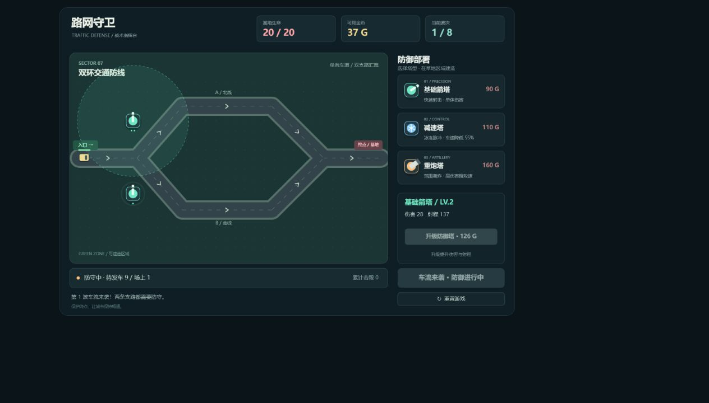

# 路网守卫 · Traffic Defense

使用 HTML5 Canvas 和原生 JavaScript 开发的交通路网塔防小游戏，无外部依赖。

## 运行

用现代浏览器直接打开 `index.html`。

## 玩法

- 选择右侧塔型，点击草地建造；不能在车道或其他塔上建造。
- 基础箭塔进行单体攻击，减速塔降低车速，重炮塔造成范围伤害。
- 点击已建造的塔进行升级，鼠标悬停查看射程。
- 击毁车辆获取金币；普通车辆到达终点扣除 1 点生命，重型车辆扣除 2 点。
- 准备倒计时结束自动开始下一波，也可以点击按钮提前开始。
- 守住全部 8 波即可胜利；按 Esc 取消选择。

## 代码结构

所有代码都在 `index.html` 中，按职责划分为配置、碰撞检测、路网、敌人、防御塔、弹丸、游戏主循环和渲染模块。难度与塔属性在脚本顶部调整。

## 后续更新

在本项目目录打开终端，修改文件后执行：

```powershell
git status
git add index.html README.md .gitignore preview.png
git commit -m "描述本次修改"
git push
```

如果新增了需要上传的文件，使用 `git add 文件名` 加入提交。


